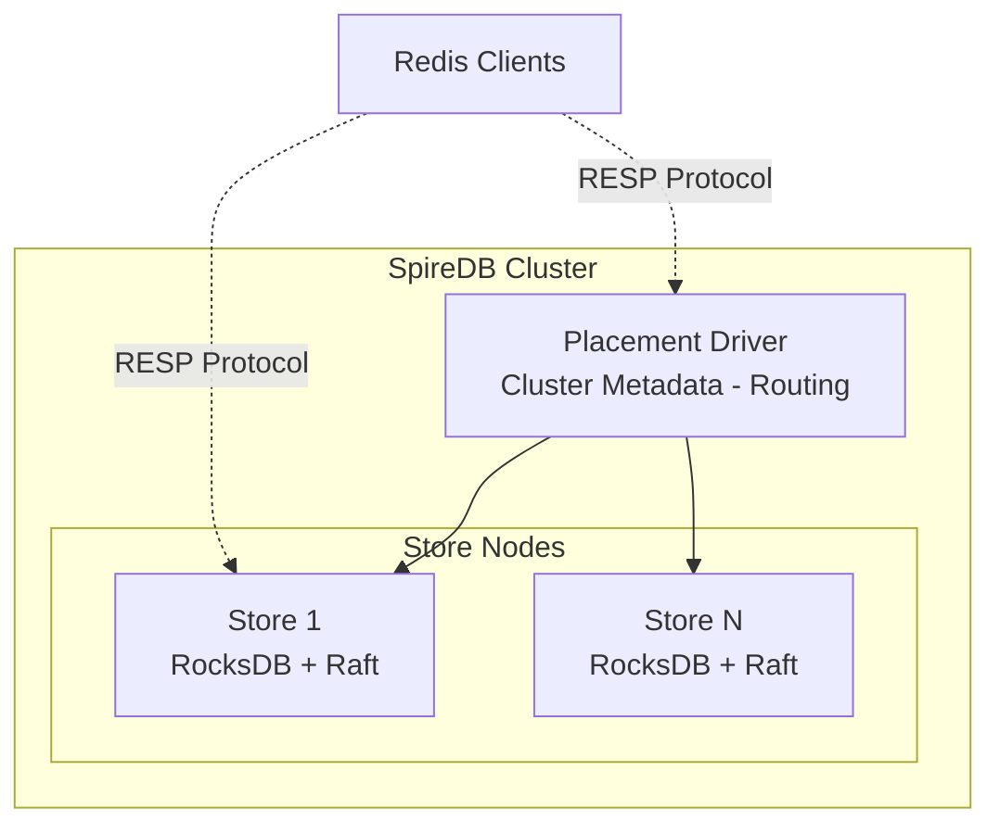

# SpireDB

A distributed key-value database with Raft consensus, Redis-compatible API, and RocksDB storage.

## Features

- **Strong Consistency** - Raft consensus ensures linearizable writes
- **Redis Compatible** - Use existing Redis clients and tools
- **High Performance** - RocksDB storage with bloom filters and block cache
- **Horizontally Scalable** - Region-based sharding across nodes
- **Production Ready** - Docker and Kubernetes deployment support

## Quick Example

```bash
# Start SpireDB
docker run -p 6379:6379 spiredb/spiredb:latest

# Connect with redis-cli
redis-cli -p 6379

> SET user:1 "alice"
OK
> GET user:1
"alice"
> INCR counter
(integer) 1
```

## Architecture Overview



## Supported Commands

| Category | Commands |
|----------|----------|
| Strings | `GET`, `SET`, `DEL`, `EXISTS`, `INCR`, `DECR`, `APPEND` |
| Multi-key | `MGET`, `MSET` |
| Utility | `PING`, `COMMAND` |

## Next Steps

- [Quick Start Guide](quickstart.md) - Get running in 5 minutes
- [Architecture](architecture.md) - Understand internals
- [Configuration](configuration.md) - Tune for your workload
- [Deployment](deployment.md) - Production setup
