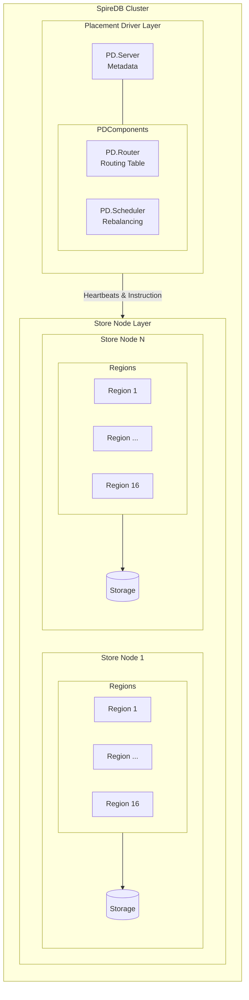
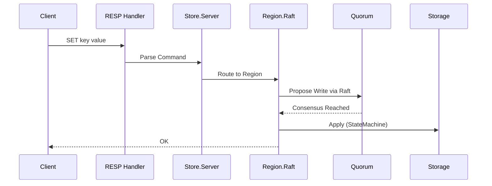
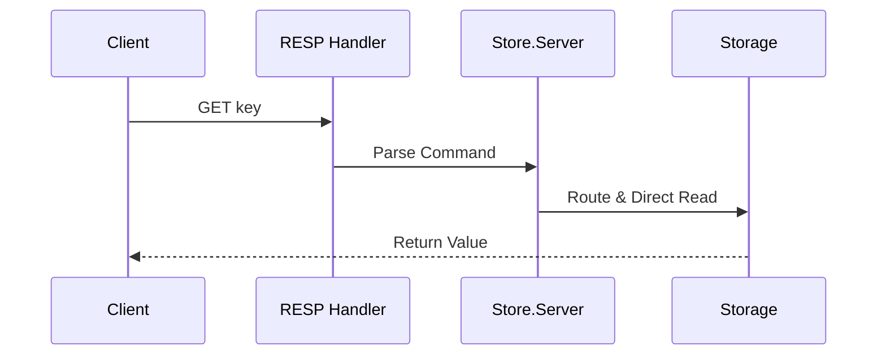
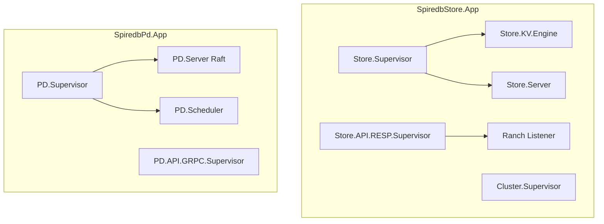

# Architecture

SpireDB is built on three core subsystems: the Placement Driver, Store Nodes, and the RESP protocol handler.

## System Overview



## Components

### Placement Driver (PD)

Central metadata service managing:

| Component | Function |
|-----------|----------|
| PD.Server | Raft-backed state machine for metadata |
| PD.Router | Key-to-region routing |
| PD.Scheduler | Automatic region rebalancing |
| PD.API.GRPC | gRPC interface for region discovery |

PD maintains:
- Store registry (alive nodes)
- Region assignments
- Cluster topology

### Store Nodes

Data storage and serving nodes:

| Component | Function |
|-----------|----------|
| Store.Server | Request coordination |
| Store.Region.Raft | Per-region Raft consensus |
| Store.KV.Engine | Persistent storage engine |
| Store.API.RESP | Redis protocol handler |

### Region

A region is a contiguous range of the key space. Each region:
- Has its own Raft group
- Replicates across multiple stores
- Splits when too large

Default: 16 regions distributed across nodes.

## Data Flow

### Write Path



Latency: 3-7ms (Raft consensus overhead)

### Read Path



Latency: 0.3-0.5ms (bypasses Raft)

## Key Encoding

Keys are hashed to determine region assignment:

```
region_id = :erlang.phash2(key, num_regions) + 1
```

Region 1 handles keys where `hash(key) % 16 == 0`, etc.

## Storage Layout

```
/var/lib/spiredb/
├── data/              # Persistent data
│   ├── CURRENT
│   ├── MANIFEST-*
│   ├── *.sst
│   └── *.log
├── raft/              # Raft logs
│   └── region_*/
│       ├── wal/
│       └── snapshot/
└── pd/                # PD metadata
```

## Supervision Tree



## Technology Stack

| Component | Technology |
|-----------|------------|
| Language | Elixir/OTP |
| Consensus | Ra (Raft) |
| Storage | LSM-Tree Engine |
| Protocol | RESP (Redis) |
| Clustering | libcluster |
| Observability | Telemetry, Prometheus |
