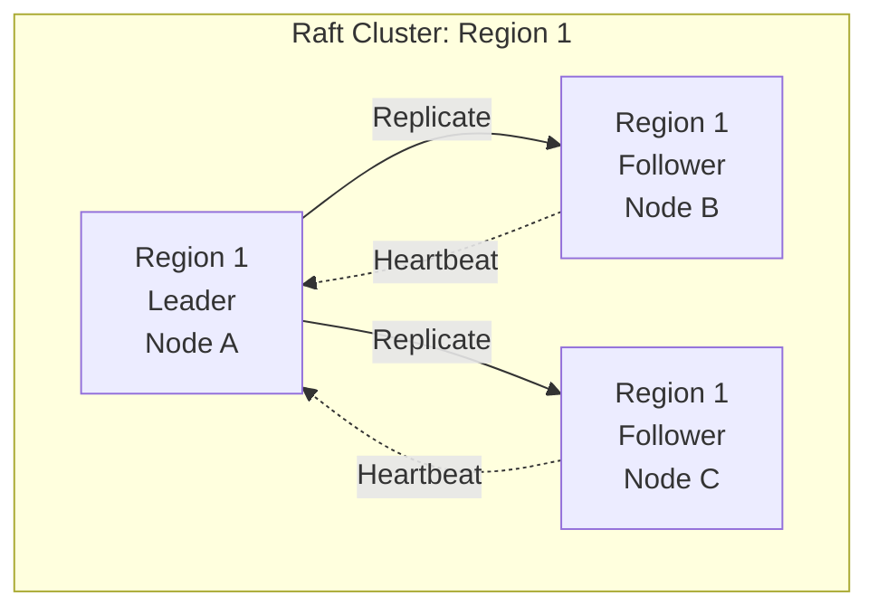
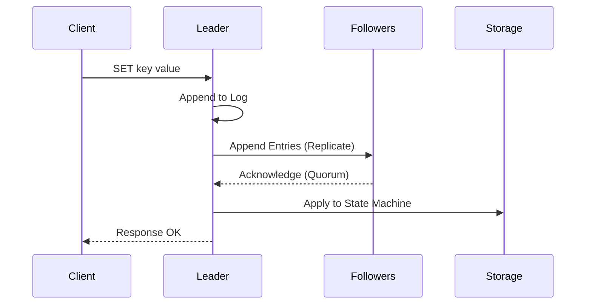

# Raft Consensus

SpireDB uses Raft for distributed consensus via the `ra` library.

## Architecture



## Components

### PD Raft

Cluster metadata consensus:
- Store registry
- Region assignments
- Key routing table

### Region Raft

Per-region data consensus:
- Key-value operations
- Replicated to 3 nodes
- Automatic leader election

## Write Path



Latency: 3-7ms (quorum wait)

## Read Path

### Default (Fast)

Direct storage read. No Raft overhead.

```
Latency: 0.3-0.5ms
```

### Linearizable

Raft read index verification.

```elixir
Store.Server.get(key, linearizable: true)
```

Latency: 1.5-2.5ms

## Configuration

```bash
# Election timeout (ms)
SPIRE_RAFT_ELECTION_TIMEOUT=1000

# Heartbeat interval (ms)
SPIRE_RAFT_HEARTBEAT_INTERVAL=150

# WAL max size
SPIRE_RAFT_WAL_MAX_SIZE=67108864
```

## Leader Election

Triggered when:
- Follower timeout (no heartbeat)
- Manual leader transfer
- Node failure detected

Election timeout: 1000ms default

## Log Compaction

Automatic snapshots every 4096 entries:

```elixir
snapshot_interval: 4096
```

Snapshots stored in `SPIRE_RAFT_DATA_DIR`.

## Failure Handling

### Leader Failure

1. Followers detect missing heartbeat
2. Election starts after timeout
3. New leader elected (~2s)
4. Writes resume

### Follower Failure

1. Quorum maintained with 2/3 nodes
2. Writes continue normally
3. Failed node rejoins and catches up

### Network Partition

Majority partition:
- Continues operation
- Elects leader if needed

Minority partition:
- Cannot accept writes
- Reads may be stale

## Monitoring

Check Raft state:

```elixir
:ra.members({:region_1, node()})
# {:ok, members, leader}
```

## Tuning

### Low Latency

```bash
SPIRE_RAFT_HEARTBEAT_INTERVAL=50
SPIRE_RAFT_ELECTION_TIMEOUT=300
```

### Network Tolerance

```bash
SPIRE_RAFT_HEARTBEAT_INTERVAL=500
SPIRE_RAFT_ELECTION_TIMEOUT=3000
```
